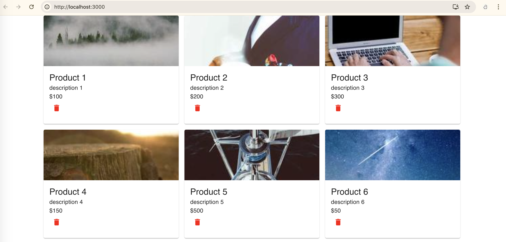
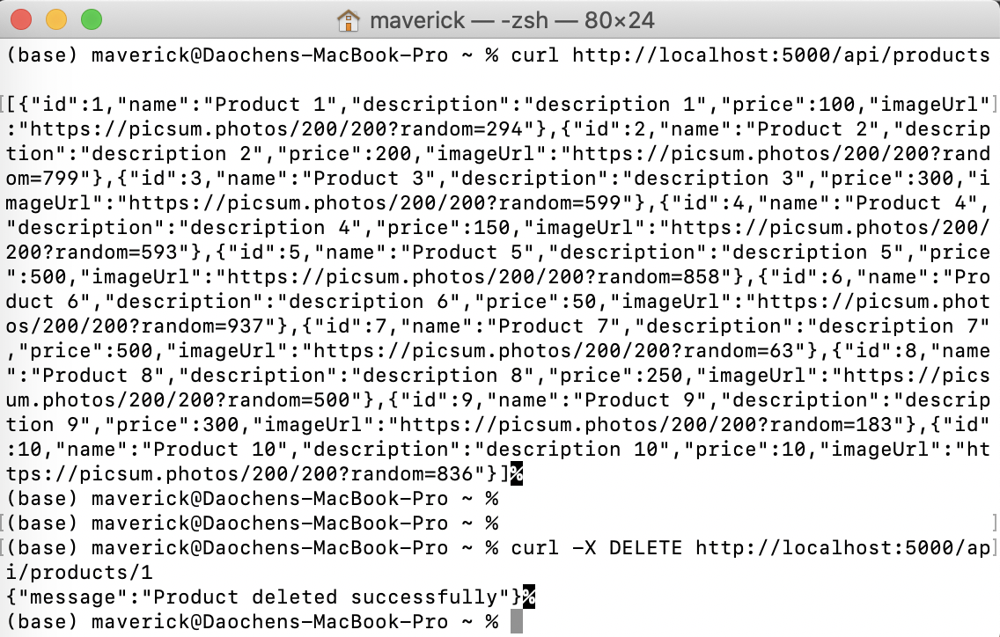

# SWE INTERVIEW TEST 
THIS IS TO TEST YOUR SKILLS TO MEET OUR APP DEVELOPMENT REQUIREMENTS

1. Clone this repo to your local machine.
2. Read `Assignment Requirements` carefully and follow it.
4. Please commit your entire code to `your own Github repository` 
5. On your repo, please add step-by-step instructions on how to launch (for both the Backend and Frontend) to the `README.md`
6. Share your repo link with us via email.

HAPPY CODING! </br>
A Round Entertainment


## Instructions

*Author: Bill L.*

*Timestamp: 09/20/24*

---

### Install NVM (Node Version Manager), Node.js, npm (Node Package Manager)

https://github.com/nvm-sh/nvm


> Downloads and runs the install script for NVM.
```bash
curl -o- https://raw.githubusercontent.com/nvm-sh/nvm/v0.40.1/install.sh | bash
```

> Adds NVM environment configuration to `~/.zshrc` file (Zsh configuration) in the Vim editor.

```bash
vim ~/.zshrc
```

```bash
export NVM_DIR="$([ -z "${XDG_CONFIG_HOME-}" ] && printf %s "${HOME}/.nvm" || printf %s "${XDG_CONFIG_HOME}/nvm")"
[ -s "$NVM_DIR/nvm.sh" ] && \. "$NVM_DIR/nvm.sh" # This loads nvm
```

> Reloads the Zsh configuration file (`.zshrc`) to apply the changes made above, which makes the NVM command available in the current session.
```bash
source ~/.zshrc   # For Zsh
```

> Verifies that NVM is installed correctly by checking the version.
```bash
nvm -v
```

> Lists all the available versions of Node.js.
```bash
nvm ls-remote
```

> Installs the latest version of Node.js, which includes npm.
```bash
nvm install node
```

> Activates the latest version of Node.js installed using NVM.
```bash
nvm use node
```

> Verifies the installation of Node.js by checking the version.
```bash
node -v
```

> Verifies the installation of npm by checking the version.
```bash
npm -v
```

---

### Frontend Setup

> Navigates into the `frontend` directory inside the `StarterCode` folder.
```bash
cd StarterCode/frontend
```

> Installs the required dependencies for the frontend based on the `package.json` file.
```bash
npm install
```

> Starts the React development server for the frontend. It will launch the app at `http://localhost:3000`.
```bash
npm start
```

---

### Backend Setup

> Navigates into the `backend` directory inside the `StarterCode` folder.
```bash
cd StarterCode/backend
```

> Installs the required dependencies for the backend based on the `package.json` file.
```bash
npm install
```

> Runs the backend server using Node.js, typically be accessible at `http://localhost:5000` for handling API requests.
```bash
node index.js
```

--- 

### Backend Test

> Sends a GET request to fetch the list of all products from the backend.
```bash
curl http://localhost:5000/api/products
```

> Sends a DELETE request to remove the product with ID 1 from the backend.
```bash
curl -X DELETE http://localhost:5000/api/products/1
```

---

### Full-Stack Demo




